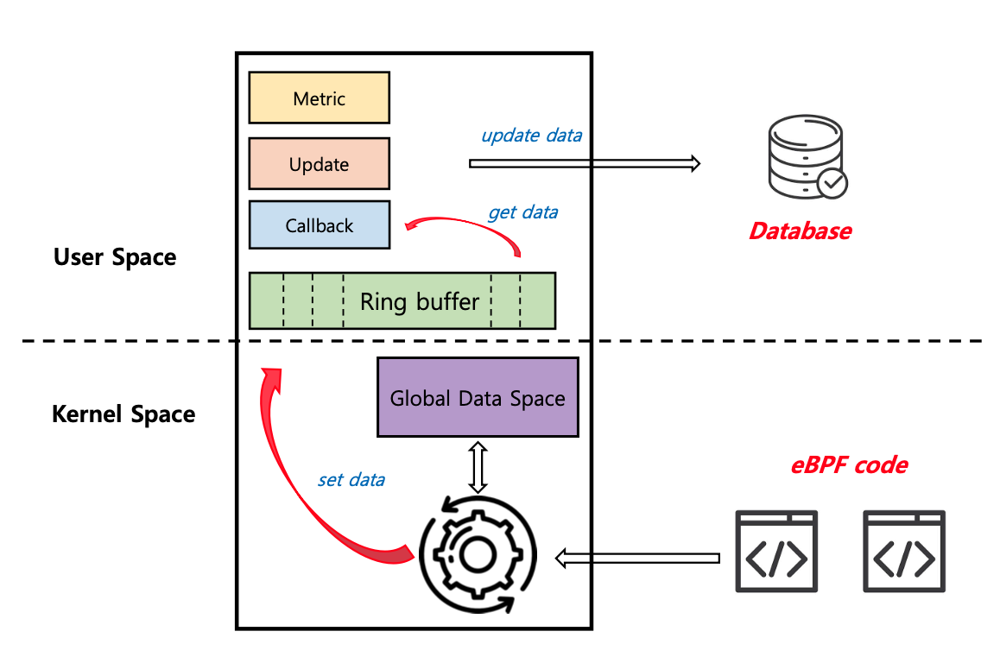
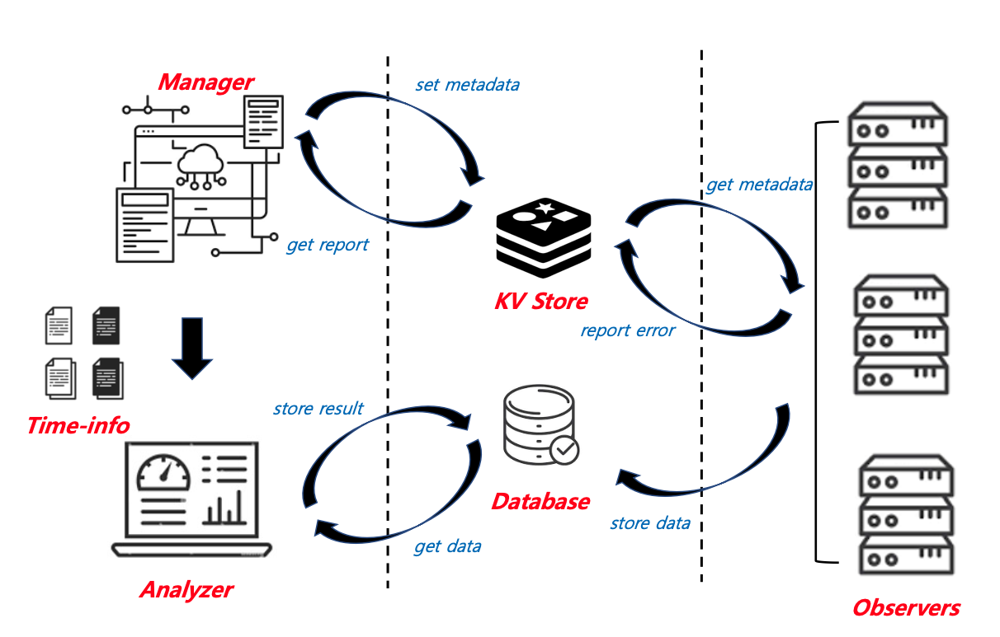
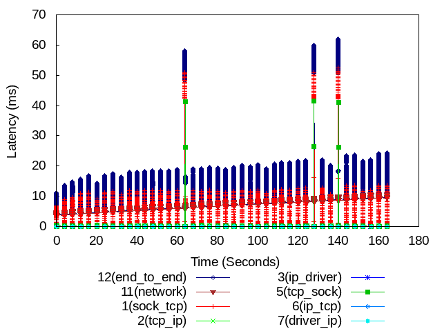
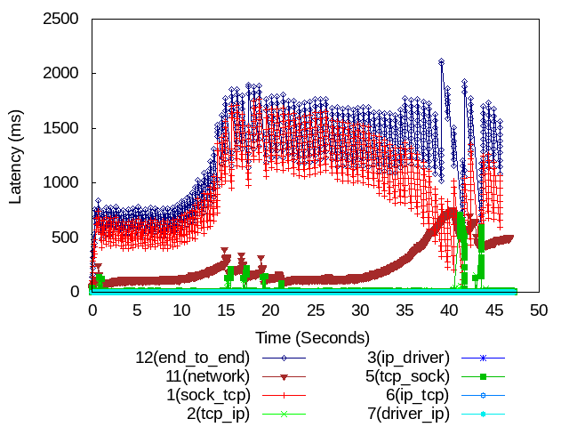
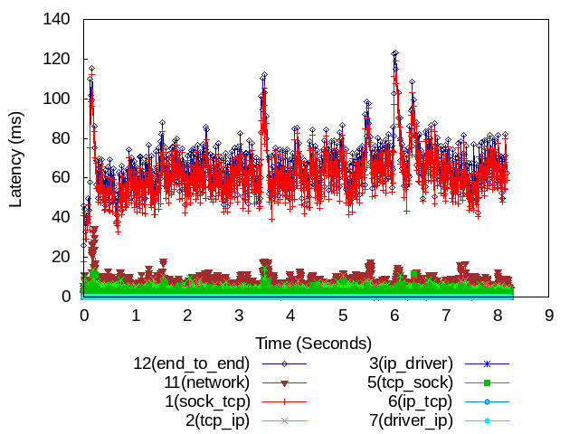

# An In-depth Latency Measurement Tool for Large-Scale Systems

## Intro
* In order to improve performance in a large-scale system, it is necessary to manage latency
* Various latency occur at different points
* But, There is no tool available for real-time measurement and detailed analysis of latency in a large-scale system

## Background
* This is extended program about ELEMENT [ELEMENT](https://netstech.org/wp-content/uploads/2019/06/element-eurosys19.pdf, "ELEMENT LINK")
* This use eBPF/XDP for fast network performance monitoring
	* eBPF
		* eBPF (extended Berkely Packet Filter) 
		* it hepls user safely execute user-defined code within certain parts of the kernel
		* it can be used in 10Gbps per-core
	* XDP
		* XDP (eXpress Data Path)
		* it is an eBPF-based high-performane data path used to bypass most operation system networking stacks
		* it can process almost 10Mpps

## Architecture
* Internel Architecture
	* 
* External Architecture
	* 

## Requirements
* Redis
	* For Communication Tool between other servers
* MySQL
	* For a storage as the data collected by Observer
* paramiko
	* Python Package which is used for SSH connection
	
## Code Structure
* Metric\_Collector
	* ebpf\_program\_vm
		* metric\_measure\_vm
			* ebpf\_code.py
			* ebpf\_conf.py
			* ebpf\_database.py
			* ebpf\_main.py
			* ebpf\_python.py
		* time\_sync
			* ebpf\_code.py
			* ebpf\_conf.py
			* ebpf\_main.py
			* ebpf\_python.py
	* time\_sync\_manage
		* ebpf\_code.py
		* ebpf\_python.py
	* ebpf\_preprocess.py
	* ebpf\_terminal.py
	* ebpf\_database.py
	* ebpf\_conf.py
	* ebpf\_analyzer.py
	* ebpf\_main.py
	* conf
		* connect\_info.yaml
		* function\_info.yaml
		* ping\_info.yaml
		* sampling\_info.yaml
		* database\_info.yaml
		* management\_server\_info.yaml
		* redis\_info.yaml

## Code File
* time\_sync\_manage
	* It is used by Management server for Time Synchronization between each servers
	* It make UDP packet and send them to other servers
* time\_sync
	* It is used by Observer for Time Synchronization
	* It installed XDP program
* ebpf\_program\_vm
	* Observer Code
	* It collects network metric to central database
* ebpf\_analyzer
	* It calculates the network performance
* ebpf\_preprocess
	* It install Observer code in each server
	* It set tables in Relational Database
* ebpf\_mainprocess
	* It executes Observer in each server
* ebpf\_main
	* It is a entry point

## Configuration FILE
* conf
	* connect\_info.yaml (server connect info (address, port, virtual machine etc..))
	    
		| variable | meaning | example |
		| -------- | ------- | ------- |
		| address  | address (used by ssh) | 10.1.1.1 |
		| port     | port (used by ssh) | 5000 |
		| username | name (used by ssh) | sonic |
		| hostname | server name (used by analyzer) | node1 |
		| metadata_key | unique key (used by per server) | 1 |
		| novm | it is a bare-metaal server | metadata_key |
		| isvm | who is the vm's host | metadata_key |
		| eth | which interface attach | interface names |
		| other_address | other address (used by server) | other address |
		| iscontainer | who is the container's host | metadata_key |
	* function\_info.yaml (Which function probed? Not Yet Activated)
	* ping\_info.yaml (Information for Time-Synchronization)
		
		| variable | meaning | example |
		| -------- | ------- | ------- |
		| address | address (where to ping) | 10.1.1.1 |
		| port | port (where to ping) | 5000 |
		| eth | interface (used by XDP) | enp1s0 |
	* sampling\_info.yaml (Information for Sampling Rate, Address, Port)

		| variable | meaning | example |
		| -------- | ------- | ------- |
		| size | sampling rate (payload size) | 72400 (bytes) |
		| interval | sampling rate (time interval) | 1 (sec) |
		| ports | sampling port (port that interested) | 5000 |
	* database\_info.yaml (Information for Database (Address, Port, Passwd etc..))

		| variable | meaning | example |
		| -------- | ------- | ------- |
		| user | db's user | xxxx |
		| passwd | db's password | xxxx |
		| host | db's address | xxxx |
		| db | which db | xxxx |
	* management\_server\_info.yaml (Information for Management server (Reporting, Communication etc..))
		
		| variable | meaning | example |
		| -------- | ------- | ------- |
		| address | manager server's address | 10.1.1.1 |
		| port | manager server's port | 5000 |
		| username | manager server's name | xxxx |
		| password | manager server's password | xxxx |
		| hostname | manager server's hostname | xxxx |
		| eth | manager server's interface (used by XDP) | xxxx |
	* redis\_info.yaml (Information for KV Store (Address, Port, Passwd etc..))

		| variable | meaning | example |
		| -------- | ------- | ------- |
		| address | redis's address | 10.1.1.1 |
		| port | redis's port | 5000 |

## Execution
* First, Install MySQL, Redis
* Second, Setting Configuration files properly which is mentioned above
* Third, Exchange SSH keys between Manager and Proved Server
<pre><code>
sudo python3 ebpf_main.py
</code></pre>

## Example
* Result Example
	* Result Example1 (LAN)
		* 
	* Result Example2 (LTE)
		* 
	* Result Example3 (WIFI)
		* 
